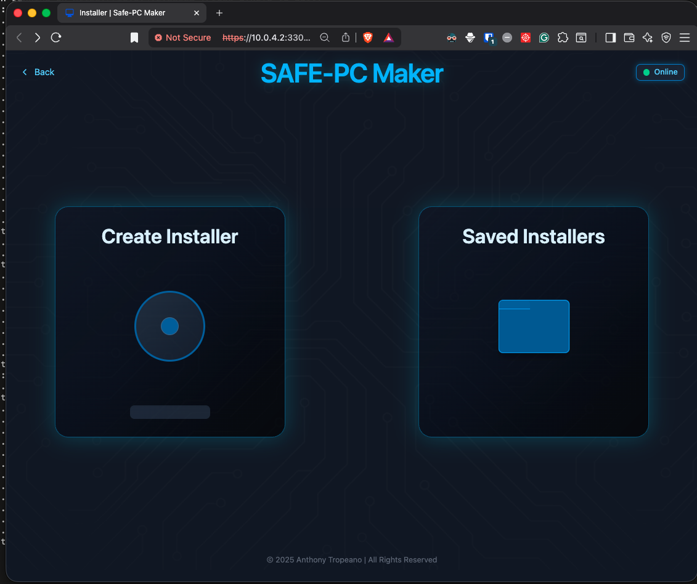
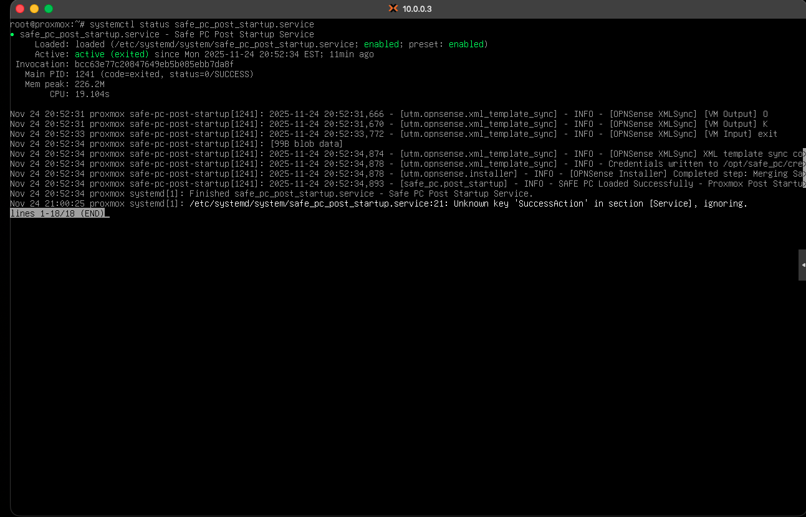

# SAFE-PC


## Secure Appliance Framework for End-of-Life PCs

## Screenshot



## Demo

### SAFE-PC ISO Creation

[](https://drive.google.com/file/d/1IGebJqlSwDaS-BZdcW4aNUjknVJzXfZ4/view?usp=sharing)

> Note. This video provides an overview of creating an unattended installation ISO and the user interface.

### SAFE-PC VM Installation Video

[](https://drive.google.com/file/d/1JyJ1LLzaks5_ypofQaAbmLkIQhlW2ld3/view?usp=sharing)

> Note. This video provides an overview of a SAFE-PC un-attended installation in a virtual machine, takes roughly 15 minutes to complete.

## Table of Contents

- [SAFE-PC](#safe-pc)
  - [Secure Appliance Framework for End-of-Life PCs](#secure-appliance-framework-for-end-of-life-pcs)
  - [Screenshot](#screenshot)
  - [Demo](#demo)
    - [SAFE-PC ISO Creation](#safe-pc-iso-creation)
    - [SAFE-PC VM Installation Video](#safe-pc-vm-installation-video)
  - [Table of Contents](#table-of-contents)
  - [Description](#description)
  - [Academic Context](#academic-context)
  - [Overview](#overview)
  - [Why This Research Matters](#why-this-research-matters)
  - [Project Goals](#project-goals)
  - [Installation](#installation)
    - [Via Python](#via-python)
    - [Via Docker](#via-docker)
  - [Usage](#usage)
  - [License](#license)
  - [Contact](#contact)
  - [Citation](#citation)

## Description

This repository represents a senior **Capstone Project** in Cyber Operations - Engineering and the 'capstone' branch
represents the state of the project at submission.

The goal of **_`SAFE-PC`_** is to demonstrate the feasibility of repurposing obsolete PCs into `automated`, `cost-effective` `security appliances` while simultaneously addressing the growing challenge of `electronic waste`.

This project emphasizes:

- Sustainable IT practices
- Practical deployment of open-source security tools
- Academic research into cost-effective defensive frameworks

## Academic Context

This repository represents the **hands-on implementation component** of a Cyber Operations - Engineering emphasis Capstone Project at the **University of Arizona**. The accompanying thesis explores the broader academic context, while this repository demonstrates a working framework for turning theory into practice.

## Overview

As Windows 10 reaches end-of-life and millions of PCs face obsolescence, this project demonstrates that these devices can be repurposed into automated, cost-effective **security appliances**, commonly referred to as **UTM** (_Unified Threat Management_) devices, using open-source technologies and virtualization.

The motivation is twofold:

1. **Windows 10 End of Support:** Microsoft will end support for Windows 10 in **October 2025**, leaving millions of still-functional PCs labeled as “obsolete” and destined for e-waste.

2. **Security Gaps for Consumers and SMBs:** Most homeowners and small-to-medium businesses rely on **basic ISP-provided hardware** that offers little more than NAT (Network Address Translation) with minimal defensive capability.

By leveraging **Proxmox** for virtualization and custom automation written in **Python**, SAFE-PC integrates open-source security tools into legacy PCs, turning them into practical cybersecurity appliances that extend hardware lifecycles and reduce e-waste.

## Why This Research Matters

The **end of Windows 10 support** will create an unnecessary surge of e-waste as otherwise functional PCs are retired. At the same time, **cyber-attacks against consumers and SMBs** are rising, and many continue to depend on low-cost ISP or consumer-grade hardware with almost no real security features.

**SAFE-PC bridges these challenges by:**

- Repurposing legacy PCs into **dedicated security appliances** rather than discarding them.
- Deploying academically sound, open-source security tools within a Proxmox environment on repurposed hardware.
- Delivering **affordable, accessible security** to households and SMBs traditionally underserved by enterprise-grade solutions.

SAFE-PC demonstrates that **sustainability and cybersecurity can reinforce each other**.

## Project Goals

- ♻️ **Reduce E-Waste:** Extend the life of PCs that would otherwise be discarded.
- 🔒 **Enhance Security:** Provide better defenses than consumer-grade routers.
- 💰 **Increase Accessibility:** Enable cost-effective security solutions for small organizations and homes.
- 🌍 **Sustainable IT:** Bridge the gap between environmental responsibility and cybersecurity readiness.

## Installation

While a Docker Container exists, and a package has been created for SAFE-PC, due to the need for environment variables, it is still recommended to clone the repository and install it locally either as a Docker Container or a Python Module.

Poetry commands are included but usage is not required. To install Poetry, [refer to their documentation](https://python-poetry.org/docs/#installation).

### Via Python

1. Clone the repo:

   ```sh
   git clone git@github.com:iiTONELOC/safe-pc.git
   ```

2. Ensure system dependencies

   Note, many of these dependencies like Python3, tzdata, git, and rsync should already be installed and will be updated if necessary.

   ```sh
   sudo apt-get update && sudo apt-get install build-essential cpio curl git python3 python3-dev python3-pip python3-venv qemu-utils rsync squashfs-tools tzdata wget xorriso zstd
   ```

   [Install NVM](https://github.com/nvm-sh/nvm?tab=readme-ov-file#installing-and-updating)

   Ensure Node is installed (note you will have to resource your shell or start a new session for the nvm command to work)

   ```sh
   nvm install node
   nvm use node
   ```

3. Create a Python Virtual Environment (can be skipped if not using virtual environments)

   ```sh
   cd safe-pc && python3 -m venv venv  && source venv/bin/activate
   # should notice a change in the terminal to have (venv) appended before the current user and path, ie:
   # (venv) dev@disdeveloper:~/capstone_example/safe-pc$
   ```

4. Install SAFE-PC as a Python Module

   ```sh
   # if using a virtual environment
   venv/bin/python3 -m pip install -e ./

   # if using Poetry
   poetry install .

   # if using pipx
   pipx install .

   # otherwise install via pip
   python3 -m pip install -e ./
   ```

5. Install the front-end dependencies and build generate the CSS

   ```sh
   cd src/proxmox_auto_installer/front_end/tailwindcss/ && npm i && npm run build && cd ../../../../

   # expected output

   up to date, audited 121 packages in 565ms

   36 packages are looking for funding
   run `npm fund` for details

   > tailwindcss@1.0.0 build
   > tailwindcss -i ./styles/app.css -o ../static/css/tailwind.css --minify

   ≈ tailwindcss v4.1.14

   Done in 32ms
   ```

6. The env.sh file contains environment variable exports with default values:

   > Note
   > If any of the default values need to be changed, simply change the value after the `:-` as appropriate:

   ```md
   # Firewall LAN IP configuration

   # change these only if they conflict with an existing network

   export SAFE_LAN_PREFIX="${SAFE_LAN_PREFIX:-192.168.1}"
   export SAFE_LAN_BIT_COUNT="${SAFE_LAN_BIT_COUNT:-24}"
   export SAFE_LAN_FW_HOST="${SAFE_LAN_FW_HOST:-${SAFE_LAN_PREFIX}.254}"
   export SAFE_SENSE_PWD="${SAFE_SENSE_PWD:-UseBetterPassword!23}"

   # Proxmox username - default is root

   export PROX_USER="${PROX_USER:-root}"

   # Proxmox management interface configuration

   # Configuration settings for the out-of-band management interface

   export PROX_CIDR="${PROX_CIDR:-192.168.1.38/24}"
   export PROX_GATEWAY="${PROX_GATEWAY:-192.168.1.254}"
   export PROX_DNS="${PROX_DNS:-192.168.1.254}"
   export PROX_TZ="${PROX_TZ:-America/New_York}"

   # Host with Answer File

   # IP address for the machine serving the answer file, required by the

   # Proxmox installer.

   export HOST_IP="${HOST_IP:-192.168.1.206}"
   ```

   > Note

   > `SAFE_SENSE_PWD` uses a default value! This is not secure and it should be changed!

   ```sh
   nano env.sh
   ```

   > Note.

   > Make changes after the `:-`.
   >
   > Save changes with <kbd>Ctrl</kbd> + <kbd>S</kbd> and leave with <kbd>Ctrl</kbd> + <kbd>X</kbd>

   ***

### Via Docker

1. Clone the repo:

   ```sh
   git clone git@github.com:iiTONELOC/safe-pc.git
   ```

2. Modify the Dockerfile-Compose file to overwrite any default env values if needed:

   > Note

   > `SAFE_SENSE_PWD` uses a default value! This is not secure and it should be changed!

   ```yml
   # existing values

   environment:
     PYTHONUNBUFFERED: "1"
     HOST_IP: "${HOST_IP:-192.168.1.206}"

     # Proxmox settings

     PROX_USER: "${SAFE_USER:-root}"
     PROX_DNS: "${PROX_DNS:-192.168.1.254}"
     PROX_TZ: "${PROX_TZ:-America/New_York}"
     PROX_CIDR: "${PROX_CIDR:-192.168.38/24}"
     PROX_GATEWAY: "${PROX_GATEWAY:-192.168.1.254}"

     #OPNsense settings
     SAFE_LAN_PREFIX: "${SAFE_LAN_PREFIX:-192.168.1}"
     SAFE_LAN_BIT_COUNT: "${SAFE_SUBNET_BIT_COUNT:-24}"
     SAFE_LAN_FW_HOST: "${SAFE_LAN_FW_HOST:-${SAFE_LAN_PREFIX}.254}"
     SAFE_SENSE_PWD: "${SAFE_SENSE_PWD:-UseBetterPassword!23}"
   ```

   > Note.

   > Make changes after the `:-`.
   >
   > Save changes with <kbd>Ctrl</kbd> + <kbd>S</kbd> and leave with <kbd>Ctrl</kbd> + <kbd>X</kbd>

   ```sh
   nano docker-compose.yml
   ```

3. Ensure certs, data, dist, and logs, exist locally, these are all ignored from Git.

   ```sh
   mkdir certs data dist logs
   ```

4. Build the container.

   ```sh
   docker compose -f docker-compose.yml build
   ```

## Usage

1. Start Application Servers.

   To start the server for the user interface and answer file server:

   ```sh
   # using python
   # source the env file and launch the servers manually
   source env.sh && python3 src/proxmox_auto_installer/back_end/server.py

   # using Poetry
   source env.sh && poetry run start

   # example output
   (venv) dev@disdeveloper:~/capstone_example/safe-pc$ source env.sh && python3 src/proxmox_auto_installer/back_end/server.py
   INFO:     Started server process [10344]
   INFO:     Waiting for application startup.
   INFO:     Application startup complete.
   INFO:     Started server process [10344]
   INFO:     Waiting for application startup.
   INFO:     Application startup complete.
   INFO:     Uvicorn running on http://10.0.4.2:33007 (Press CTRL+C to quit)
   INFO:     Uvicorn running on https://10.0.4.2:33008 (Press CTRL+C to quit)

   #----------------------------------------------------------------------------------------


   # using Docker
   docker compose -f docker-compose.yml up

   # example output
   [+] Running 2/2
   ✔ safe_pc-latest     Built                             0.0s
   ✔ Container safe-pc  Created                           0.0s
   Attaching to safe-pc
   safe-pc  | INFO:     Started server process [1]
   safe-pc  | INFO:     Waiting for application startup.
   safe-pc  | INFO:     Application startup complete.
   safe-pc  | INFO:     Started server process [1]
   safe-pc  | INFO:     Waiting for application startup.
   safe-pc  | INFO:     Application startup complete.
   safe-pc  | INFO:     Uvicorn running on http://10.0.4.2:33007 (Press CTRL+C to quit)
   safe-pc  | INFO:     Uvicorn running on https://10.0.4.2:33008 (Press CTRL+C to quit)

   ```

   > Note.
   > The self-signed cert should be generated automatically if missing. However, if it isn't and the server will not
   > start, it can be generated manually:
   >
   > ```sh
   > # gen cert and start servers
   > python3 src/utm/utils/crypto/X509.py && python3 src/proxmox_auto_installer/back_end/server.py
   > # with Poetry
   > poetry run gen-cert && poetry run start
   > ```

2. To view the front end use the `HTTPS URL` with a port of `33008`. A privacy waring will appear due to the self-signed
   certificate, this can safely be `ignored`.
3. Create a Proxmox Unattended Installer for SAFE-PC.
4. Download ISO to USB, I recommend [Ventoy](https://www.ventoy.net/en/index.html) for ease of use. If you wish to use something different for preparing the USB, [please follow Proxmox's documentation](https://pve.proxmox.com/wiki/Prepare_Installation_Media).
5. **Ensure the management interface is connected to the current network**, the WAN/LANs can be connected now if it will not disrupt the Internet connection to the management interface. If the management Interface receives its Internet from the current LAN (most common), wait until AFTER OPNsesne has be installed before connecting the WAN and LAN interfaces to the local network.
6. Place USB into desired machine and boot from it. Ensure that the BIOS has already been configured for virtualization and support for IOMMU is enabled. Each device is different and individual configurations are beyond the scope of this README.
7. Once the installation has completed, you can log into the local proxmox machine using the credentials provided during installation.
   Progress can be viewed by inspecting the logs. After logging in, either on the host or over Proxmox's Web UI

   ```sh
   tail -f /opt/safe_pc/logs/safe_pc.log
   ```

   > Proxmox's Web UI is available at `https://:<PROX_CIDR: "${PROX_CIDR:-192.168.38/24}".split("/")[0]>:8006`

   > Once the OPNsense installation has started, the remaining interfaces can be connected.

   > This will result in a loss of Internet until the installation is complete.

## License

This project is licensed under the [MIT License](../LICENSE.txt).

## Contact

Please feel free to reach out with any questions, comments, or concerns: [atropeano@arizona.edu](mailto:atropeano@arizona.edu)

## Citation

If you use SAFE-PC in academic work, please cite as:

```md
Tropeano, A. J. (2025). SAFE-PC: Secure Appliance Framework for End-of-Life PCs [Computer software]. GitHub. https://github.com/iitoneloc/safe-pc
```
